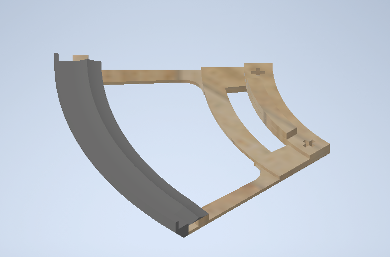
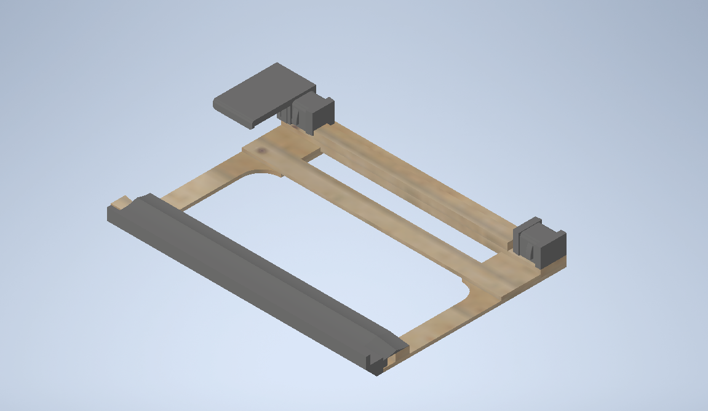
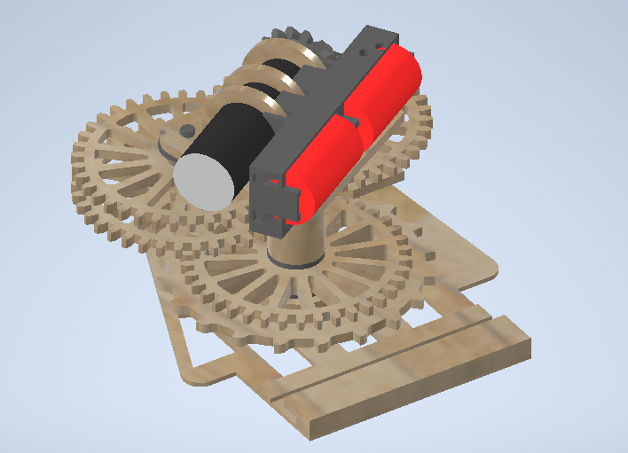

# Conveyor

## Table of Contents 

1. [about](#about)
2. [directory_construction](#directory_construction)
3. [environment](#environment)
4. [how to print](#how_to_print)
5. [trouble_shooting](#trouble_shooting)

# about

D2ロボコン用の寿司テーブルです。

(<a href="#top">Back to the top</a>)

## directory_construction

print

<!-- use tree command -->

(<a href="#top">Back to the top</a>)

## environment
Inventor 2026で作成。  
3Dプリンタはbamboolab A1mini, A1を使用

## how_to_print
作成は3Dプリンタとレーザーカッターを使用します。  
プリントデータはすべてprintディレクトリに入っています。  
各モジュールに必要なプリントは以下の通りです。  

### 最小モジュール構成数
curve_module : 8個
linear_module : 2個
power_module : 1個  

### 3dプリンタパーツ　　
SUSHIディレクトリの中にあるgcode.3mfファイルすべて(SHSHI_rail_A1, SUSHI_rail_mini はそれぞれ2回ずつ)

### レーザーパーツ
枚数が書いていないものは1枚です

#### パラメーター
MDFのパラメータです(2025/10/31)  
2.5mm : 850,75,3
5.5mm : 450,80,3

高さ調節は2.5mm、5.5mmともに2.5mmに合わせてください。

#### curve_module

- curve_module\back_under : 5.5mm
- curve_module\back_upper : 5.5mm
- curve_module\front : 5.5mm
- curve_module\base : 2.5mm
- curve_module\rail_base : 2.5mm
- curve_module\base : 2.5mm / 2枚
- curve_module\wall : 2.5mm
#### linear_module

- linear_module\back_under : 5.5mm
- linear_module\back_upper : 5.5mm
- linear_module\front : 5.5mm
- linear_module\base : 2.5mm
- linear_module\rail_base : 2.5mm
- linear_module\base : 2.5mm / 2枚
- linear_module\wall : 2.5mm
#### power_module

- power_module_gears\M3_15 : 5.5mm / 2枚
- power_module_gears\M3_15_input : 5.5mm / 2枚
- power_module_gears\M3_15_hole_small : 5.5mm / 2枚
- power_module_gears\M3_15_input_hole_small : 5.5mm / 1枚
- power_module_gears\M3_38 : 5.5mm / 3枚
- power_module_gears\roller : 5.5mm

- power_module_motor\gear_plate_cover : 5.5mm
- power_module_motor\gear_plate_cover_2 : 5.5mm / 2枚
- power_module_motor\gear_plate_cover_3 : 5.5mm
- power_module_motor\gear_plate_cover_4 : 5.5mm
- power_module_motor\motor_setter_fixer : 5.5mm
- power_module_motor\motor_setter_front : 5.5mm
- power_module_motor\motor_setter_middle : 5.5mm

- power_module_plate\connector : 2.5mm / 3枚
- power_module_plate\gear_plate_1 : 5.5mm
- power_module_plate\gear_plate_2 : 5.5mm, 2.5mm
- power_module_plate\gear_plate_3 : 5.5mm
- power_module_plate\gear_plate_base : 2.5mm
- power_module_plate\stopper : 2.5mm

#### 皿
- ./dish_print : 2.5mm / 17セット

(<a href="#top">Back to the top</a>)

## trouble_shooting
動かないときは丸山を呼んでください。

(<a href=\"#top\">Back to the top</a>)
